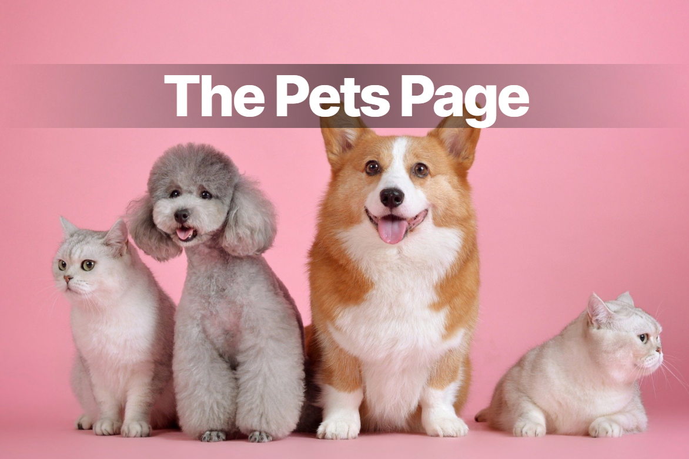

<header align="center">
 <h1>Thank You For Stopping By</h1>
 <h2>Hello, I'm Angela&nbsp;&nbsp;&nbsp;<b>|</b>&nbsp;&nbsp;&nbsp;Veterinarian &nbsp;&nbsp;Educator &nbsp;&nbsp;Nascent Web Developer 🚀</h2>
  
Currently learning mobile-first responsive design, JavaScript, HTML/CSS, SCSS, PHP, React, Bootstrap

</header>

 

 
 

<section align="center">
  <h2>Some of my projects</h2>
   
  
  
  
  
  
  
  
  
</section>

 
 

 

<section>
  <h2 align="center">About Me</h2>
   
  
The first HTML element I ever created and styled in the late 90s was a purple, bold "marquee" that traveled across the top of a fan page I made for my favorite band. Since then, I've come a long way, but there's still a lot to learn!

   
  
So far, I have experience in the following languages and tools...

   
  

    
    
     
    
    
    
    
    
     
     
     
  

  
<b>...and looking forward to learning even more!</b>

   
   <h3>Other Info About Me - The Speed-Dating Version</h3>
   
Avid reader of Christie mysteries<b> &nbsp;|&nbsp; </b><a href="https://www.akc.org/dog-breeds/shetland-sheepdog/">Shelties</a> are my favorite breed of dog<b> &nbsp;|&nbsp; </b>Currently rediscovering the music of Green Day and Goldfrapp

</section>
 

 

<section>
<h2 align="center">About You</h2>
 
<h3>Some of my favorite things to learn about people</h3>
<ul>
  <li>Are you a banana bread purist?</li>
  <li>What was your path to web development and/or computer science?</li>
  <li>Do you have any pets? Do you have any pictures of your pets? Can I see them?</li>
  <li>What's the most exciting thing you've learned in the past few weeks?</li>
</ul>
</section>

<footer align="center">This page made with ❤️</footer>